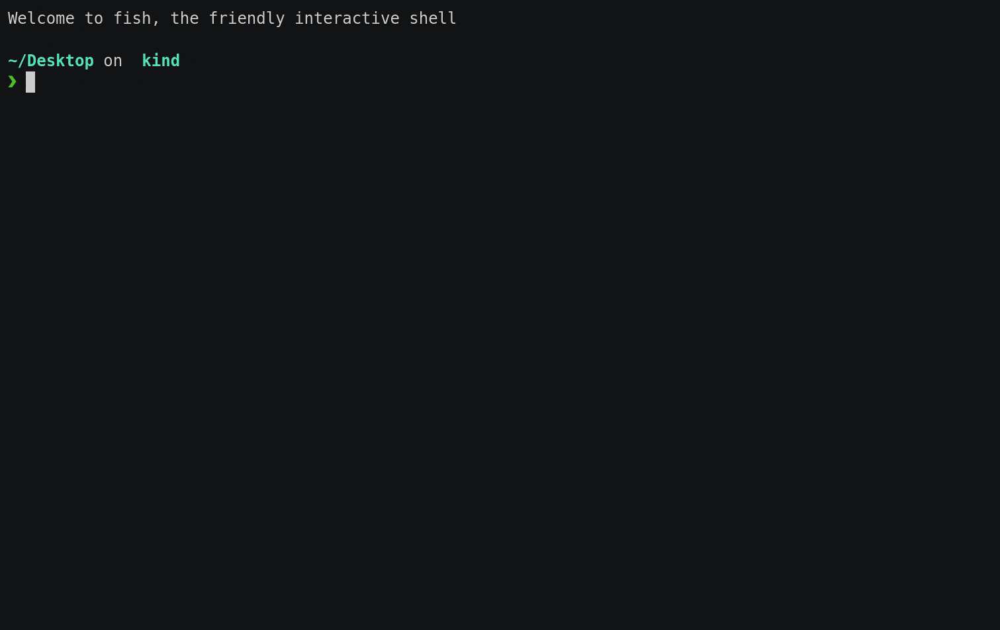
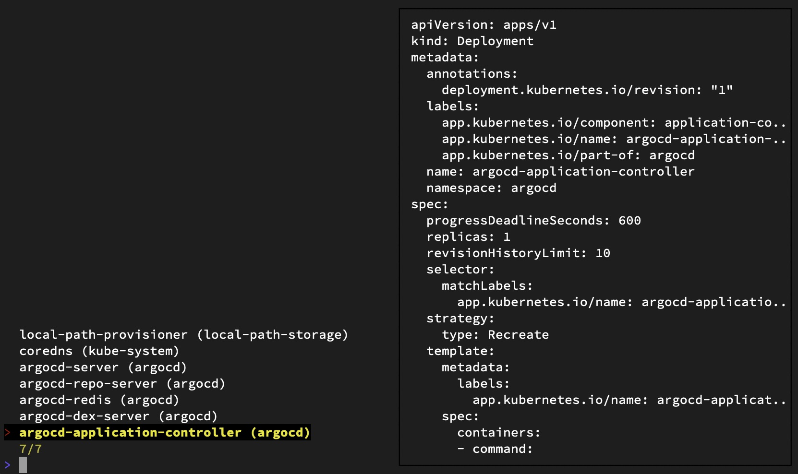

# kubectl-fuzzy


Fuzzy and partial string search for kubectl



## Summary

This tool uses [fzf(1)](https://manpages.debian.org/unstable/fzf/fzf.1.en.html)-like fuzzy-finder to do partial or fuzzy search of Kubernetes resources.
Instead of specifying full resource names to kubectl commands,
you can choose them from an interactive list that you can filter by typing a few characters.

> 📝 Notes
>
> kubectl >= v1.12.0 is required for plugins to work.
>
> For more information on kuberctl plugins see [documentation](https://kubernetes.io/docs/tasks/extend-kubectl/kubectl-plugins/)

## Install

### Krew

[Krew](https://krew.sigs.k8s.io/) is the plugin manager for kubectl command-line tool.

> 📝 See the [documentation](https://krew.sigs.k8s.io/docs/user-guide/setup/install/) for how to install Krew.

```shell
kubectl krew update
kubectl krew install fuzzy
```

### Manually

Please download the binaries from the [release page](https://github.com/d-kuro/kubectl-fuzzy/releases).

or

```shell
git clone https://github.com/d-kuro/kubectl-fuzzy.git
cd kubectl-fuzzy
make install
```

## Usage

```console
$ kubectl fuzzy -h
Fuzzy Finder kubectl

Usage:
  kubectl-fuzzy [flags]
  kubectl-fuzzy [command]

Available Commands:
  describe    Selecting a object with the fuzzy finder and show details
  exec        Selecting a Pod with the fuzzy finder and execute a command in a container
  help        Help about any command
  logs        Selecting a Pod with the fuzzy finder and view the log
  version     Show version

Flags:
  -h, --help   help for kubectl-fuzzy

Use "kubectl-fuzzy [command] --help" for more information about a command.

```

## Support Commands

* [x] `kubectl logs`
* [x] `kubectl exec`
* [x] `kubectl describe`
* anything else...

> 📝 See the [documentation](./docs/commands.md) for support commands.

## Preview Mode



You can use the `--preview` or `-P` option to display a YAML of the Kubernetes object in a fuzzy finder selector.
You can switch display to YAML or JSON with the `--preview-format` option.

e.g.

```shell
kubectl fuzzy describe deployment --preview
or
kubectl fuzzy describe deployment -P
```

The Kubernetes object displayed in the preview window is simplified by default.
Some metadata and statuses have been removed.
Use the `--raw-preview` option to display the unsimplified object.
